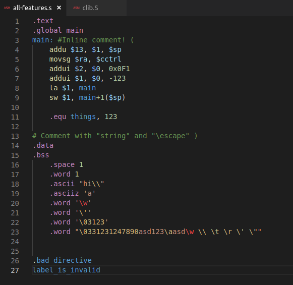
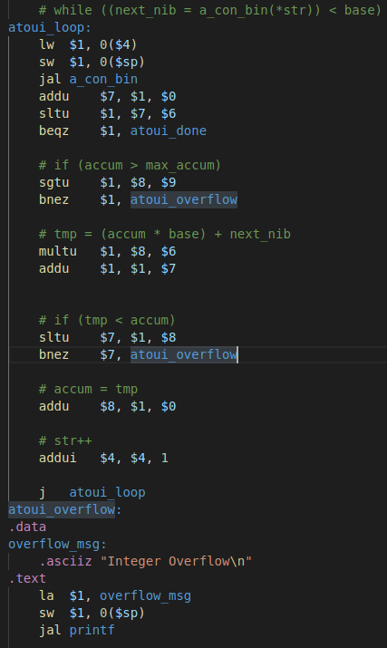

# WRAMP Assembly Syntax Highlighting

This extension provides syntax highlighting for WRAMP Assembly code. WRAMP was developed by the University of Waikato as an
easy-to-learn architecture for teaching assembly language and basic processor concepts.

## Features

Valid WRAMP Assembly syntax will be highlighted in a variety of colours depending on the token's place in the language.  
Invalid syntax (except for unrecognised escape characters) will not be displayed as invalid, and will likely appear in the
same colour as valid labels.

## Release Notes

See the [changelog](CHANGELOG.md) for release notes.
